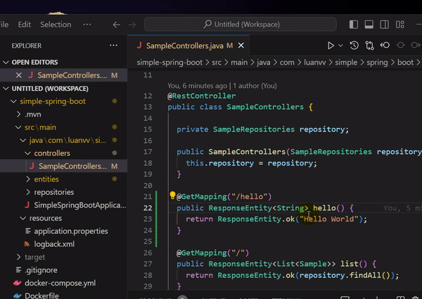

# spring-i18n

**spring-i18n** is a vscode extension that helps you to create i18n properties instantly.
Just select what you want to translate and press right click to create a new i18n property.

## Features
* Create i18n properties from selected text

## Extension Settings

This extension contributes the following settings:

* `thymeleaf.i18n.propertiesFilePaths`: list of properties files. Default value is `["src/main/resources/messages.properties"]`

## Feedback & Questions

If you discover an issue please file a bug and we will fix it as soon as possible.
* File a bug in [GitHub Issues](https://github.com/luanvuhlu/spring-i18n-extension/issues).